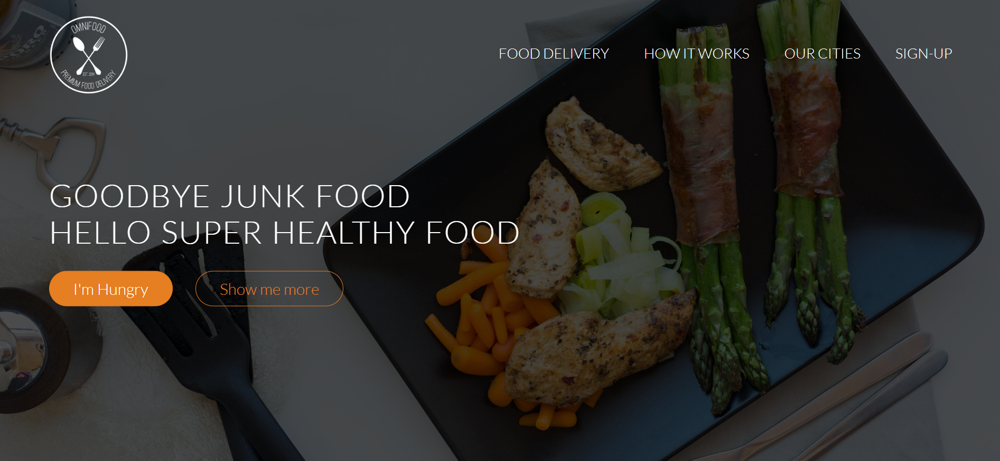
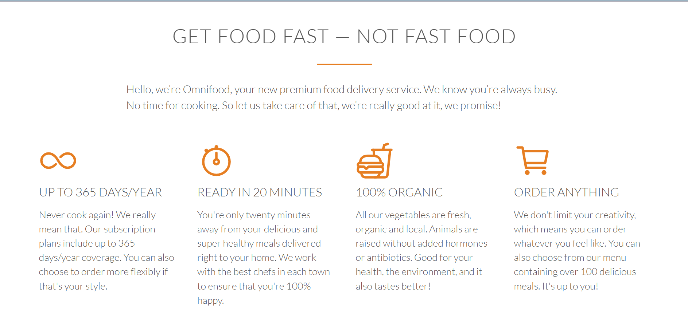
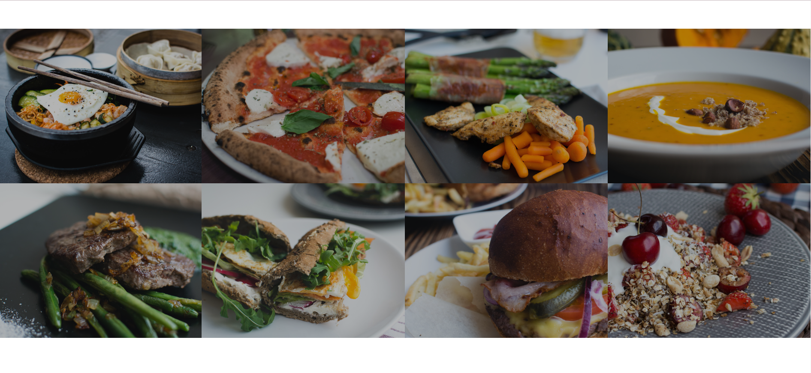

# 🍽️ Omnifoods Website  

Omnifoods is a modern, responsive food delivery website designed to provide users with a seamless experience in ordering healthy and delicious meals. The website showcases meal plans, customer testimonials, and an intuitive user interface for effortless navigation.

## 🚀 Features  

✅ Fully responsive design  
✅ Beautiful UI with smooth animations  
✅ Subscription-based meal plans  
✅ Customer testimonials section  
✅ Contact form integration  
✅ SEO-friendly structure 

## 🛠️ Technologies Used 

- **HTML5** – Structure of the website  
- **CSS3** – Styling and animations  
- **Normalize.css** – Cross-browser consistency  
- **Responsive Grid System** – Flexible and mobile-friendly layout 

## Screenshots

## 🎯 How to Use

- Clone this repository:
    git clone https://github.com/Aishwaryaa-Anand/Omnifoods-Website.git
- Navigate to the project folder:
    cd Omnifoods-Website
- Open [index.html](Omnifoods-Website
/index.html) in a browser to view the website.

## 🚀 Deployment
This project is deployed on Netlify. You can check it out here:
[🔗 MyOmnifoods Website](https://myomnifoods-website.netlify.app/)

## Demo
[🌍 Live Demo](https://myomnifoods-website.netlify.app/)  

